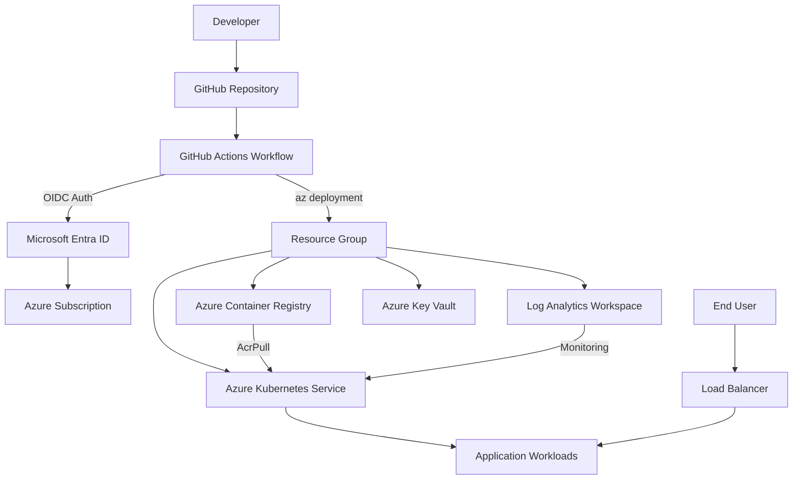

# AKS Platform with Bicep and GitHub Actions


A production-style Azure Kubernetes Service platform deployed using Infrastructure as Code (Azure Bicep) and CI/CD automation (GitHub Actions) with OIDC-based authentication — no stored secrets.

---

## Table of Contents

- [Architecture](#architecture)
- [Repository Structure](#repository-structure)
- [Tech Stack](#tech-stack)
- [Prerequisites](#prerequisites)
- [Getting Started](#getting-started)
- [Deployment](#deployment)
- [Infrastructure Modules](#infrastructure-modules)
- [Environments](#environments)
- [Security Design](#security-design)
- [Documentation](#documentation)
- [License](#license)

---

## Architecture



See [docs/architecture.md](docs/architecture.md) for detailed architecture documentation.

---

## Repository Structure

```text
aks-platform-bicep-github-actions/
├── .github/
│   └── workflows/
│       └── deploy-infra.yml          # GitHub Actions deployment workflow
├── infra/
│   └── bicep/
│       ├── main.bicep                # Orchestrator module
│       ├── aks.bicep                 # AKS cluster module
│       ├── acr.bicep                 # Container Registry module
│       ├── keyvault.bicep            # Key Vault module
│       ├── loganalytics.bicep        # Log Analytics module
│       └── params/
│           ├── dev.bicepparam        # Dev environment parameters
│           └── prod.bicepparam       # Prod environment parameters
├── k8s/
│   └── sample-app/
│       ├── deployment.yaml           # Sample Kubernetes deployment
│       ├── service.yaml              # Sample Kubernetes service
│       └── namespace.yaml            # Sample namespace
├── docs/
│   ├── architecture.md              # Architecture documentation
│   ├── deployment-guide.md          # Step-by-step deployment guide
│   └── resume-bullets.md            # Portfolio summary
├── .gitignore
├── bicepconfig.json
├── LICENSE
└── README.md
```

---

## Tech Stack

| Component | Technology |
|---|---|
| Cloud Platform | Microsoft Azure |
| Infrastructure as Code | Azure Bicep |
| CI/CD | GitHub Actions |
| Container Orchestration | Azure Kubernetes Service (AKS) |
| Container Registry | Azure Container Registry (ACR) |
| Secrets Management | Azure Key Vault |
| Monitoring | Azure Log Analytics |
| Authentication | OIDC / Microsoft Entra Workload Identity |

---

## Prerequisites

- Azure subscription
- Azure CLI (`az`) installed
- GitHub account with repository admin access
- Microsoft Entra App Registration with federated credentials for GitHub OIDC
- Contributor role on the target Azure subscription or resource group

### Azure OIDC Setup

Before the workflow can authenticate, configure a federated identity credential on your Entra App Registration:

1. Create an App Registration in Microsoft Entra ID
2. Add a federated credential:
   - **Issuer:** `https://token.actions.githubusercontent.com`
   - **Subject:** `repo:<owner>/<repo>:ref:refs/heads/main`
   - **Audience:** `api://AzureADTokenExchange`
3. Grant the App Registration **Contributor** and **User Access Administrator** roles on the target resource group
4. Add the following secrets to your GitHub repository:
   - `AZURE_CLIENT_ID` — App Registration client ID
   - `AZURE_TENANT_ID` — Entra tenant ID
   - `AZURE_SUBSCRIPTION_ID` — Azure subscription ID

---

## Getting Started

### 1. Clone the repository

```bash
git clone https://github.com/<your-username>/aks-platform-bicep-github-actions.git
cd aks-platform-bicep-github-actions
```

### 2. Review and customize parameters

Edit the environment parameter files to match your requirements:

- [`infra/bicep/params/dev.bicepparam`](infra/bicep/params/dev.bicepparam)
- [`infra/bicep/params/prod.bicepparam`](infra/bicep/params/prod.bicepparam)

### 3. Deploy

Trigger the GitHub Actions workflow manually from the **Actions** tab, or deploy locally:

```bash
az group create --name rg-srelab-dev --location eastus

az deployment group create \
  --resource-group rg-srelab-dev \
  --template-file infra/bicep/main.bicep \
  --parameters infra/bicep/params/dev.bicepparam
```

---

## Deployment

The GitHub Actions workflow supports:

- **Manual trigger** with environment selection (dev / prod)
- **Bicep validation** before deployment (`what-if`)
- **Incremental deployment** to avoid destroying existing resources
- **OIDC authentication** — no long-lived secrets stored in GitHub

See [docs/deployment-guide.md](docs/deployment-guide.md) for the full deployment guide.

---

## Infrastructure Modules

| Module | File | Resources Created |
|---|---|---|
| **Orchestrator** | [`main.bicep`](infra/bicep/main.bicep) | Coordinates all module deployments |
| **AKS** | [`aks.bicep`](infra/bicep/aks.bicep) | AKS cluster, system node pool, OMS agent, ACR pull role |
| **ACR** | [`acr.bicep`](infra/bicep/acr.bicep) | Container registry (Basic SKU, admin disabled) |
| **Key Vault** | [`keyvault.bicep`](infra/bicep/keyvault.bicep) | Key Vault with RBAC authorization, soft delete |
| **Log Analytics** | [`loganalytics.bicep`](infra/bicep/loganalytics.bicep) | Log Analytics workspace (30-day retention) |

---

## Environments

| Parameter | Dev | Prod |
|---|---|---|
| Environment | `dev` | `prod` |
| Location | `eastus` | `eastus` |
| Node Count | 1 | 2 |
| VM Size | `Standard_B2s` | `Standard_B2s` |
| K8s Version | Azure default | Azure default |

---

## Security Design

- **No stored secrets** — GitHub authenticates to Azure using OIDC federated credentials
- **System-assigned managed identity** — AKS uses managed identity, no service principal keys
- **ACR Pull role** — AKS identity is granted AcrPull on the container registry
- **Key Vault RBAC** — Azure RBAC authorization enabled (no access policies)
- **Admin disabled** — ACR admin user is disabled
- **Least privilege** — role assignments scoped to specific resources

---

## Documentation

- [Architecture](docs/architecture.md) — detailed architecture with diagrams and design decisions
- [Deployment Guide](docs/deployment-guide.md) — step-by-step deployment instructions
- [Resume Bullets](docs/resume-bullets.md) — portfolio summary for this project

---

## License

This project is licensed under the MIT License. See [LICENSE](LICENSE) for details.
