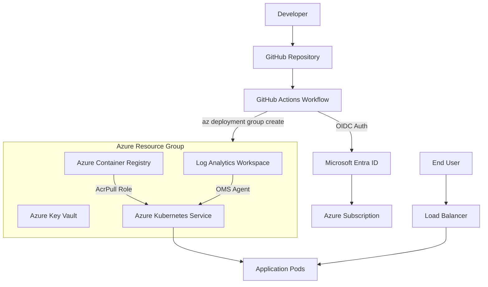
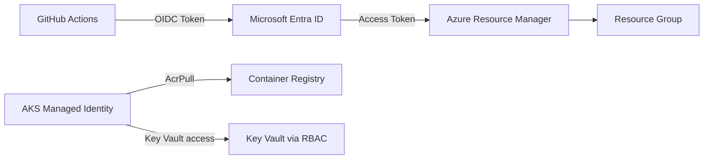
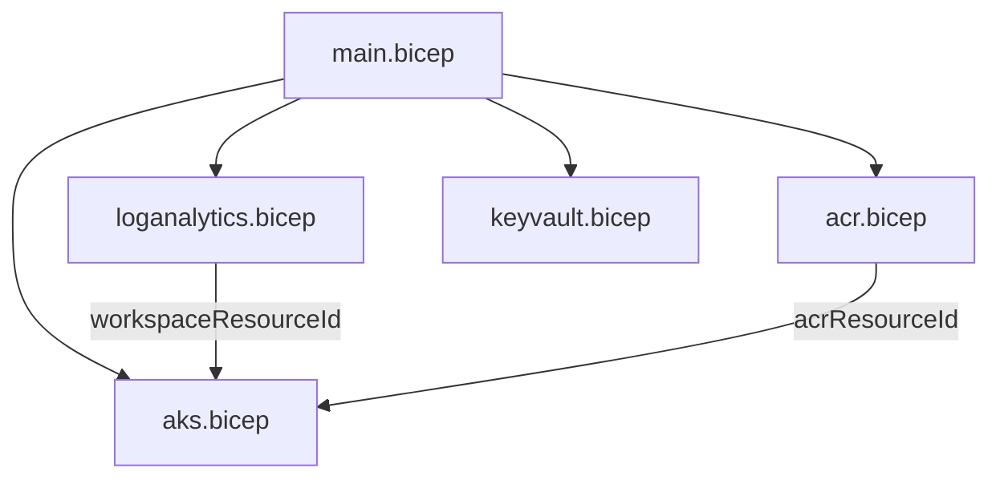

# Architecture

## High-Level Design

GitHub Actions deploys Azure infrastructure using Bicep. Authentication to Azure uses GitHub OIDC and Microsoft Entra workload identity federation, eliminating the need for stored secrets.

## Architecture Diagram

## Components

### GitHub Actions

Responsible for validating and deploying Bicep templates. The workflow:

1. Checks out the repository
2. Authenticates to Azure using OIDC (no stored secrets)
3. Validates Bicep templates
4. Runs a what-if deployment for review
5. Deploys infrastructure incrementally

### Azure Resource Group

Environment-specific container for all platform resources. Naming convention: `rg-{project}-{environment}`.

### Azure Kubernetes Service (AKS)

Managed Kubernetes cluster for containerized workloads.

| Setting | Value |
|---|---|
| Identity | System-assigned managed identity |
| Network plugin | Azure CNI |
| Load balancer | Standard SKU |
| RBAC | Enabled |
| Monitoring | OMS agent connected to Log Analytics |
| Node pool | System pool with configurable count and VM size |

### Azure Container Registry (ACR)

Private container registry for application images.

| Setting | Value |
|---|---|
| SKU | Basic |
| Admin user | Disabled |
| Access | AKS identity granted AcrPull role |

### Azure Key Vault

Secure storage for application and platform secrets.

| Setting | Value |
|---|---|
| Authorization | Azure RBAC (no access policies) |
| Soft delete | 7 days retention |
| Purge protection | Disabled (suitable for dev/test) |
| Template deployment | Enabled |

### Log Analytics Workspace

Central logging and monitoring workspace for AKS.

| Setting | Value |
|---|---|
| SKU | PerGB2018 |
| Retention | 30 days |
| Integration | AKS OMS agent addon |

## Security Design

### Key Security Decisions

- **No client secrets in GitHub** — OIDC federated credentials are used instead of service principal secrets
- **System-assigned managed identity** — AKS uses a managed identity; no keys to rotate
- **ACR Pull role assignment** — AKS identity is explicitly granted pull access to ACR
- **Key Vault RBAC** — Azure RBAC authorization replaces access policies for better governance
- **Admin user disabled on ACR** — prevents password-based access to the registry

## Module Dependencies

The `main.bicep` orchestrator deploys modules in dependency order:

1. **Log Analytics** — deployed first (AKS depends on its resource ID)
2. **ACR** — deployed in parallel with Log Analytics (AKS depends on its resource ID)
3. **Key Vault** — deployed independently (no downstream dependencies yet)
4. **AKS** — deployed last (depends on Log Analytics and ACR outputs)

## Naming Convention

All resources follow the pattern: `{type}-{project}-{environment}`

| Resource | Naming Pattern | Example |
|---|---|---|
| Resource Group | `rg-{project}-{env}` | `rg-srelab-dev` |
| AKS Cluster | `aks-{project}-{env}` | `aks-srelab-dev` |
| Container Registry | `acr{project}{env}` | `acrsrelabdev` |
| Key Vault | `kv-{project}-{env}` | `kv-srelab-dev` |
| Log Analytics | `law-{project}-{env}` | `law-srelab-dev` |
