# Deployment Guide

## Overview

This guide covers how to deploy the AKS platform infrastructure using GitHub Actions or the Azure CLI.

## Deployment Flow

```mermaid
flowchart LR
    Code[Update Bicep Files] --> PR[Pull Request]
    PR --> Review[Code Review]
    Review --> Merge[Merge to Main]
    Merge --> Trigger[Trigger Workflow]
    Trigger --> Auth[OIDC Auth to Azure]
    Auth --> Validate[Validate Bicep]
    Validate --> WhatIf[What-If Preview]
    WhatIf --> Deploy[Deploy Resources]
    Deploy --> Verify[Verify Deployment]
```



## Prerequisites

1. Azure subscription with Contributor access
2. Microsoft Entra App Registration with OIDC federated credentials
3. GitHub repository secrets configured:
   - `AZURE_CLIENT_ID`
   - `AZURE_TENANT_ID`
   - `AZURE_SUBSCRIPTION_ID`
4. Resource group created in Azure (or let the workflow create it)

## Option 1: Deploy via GitHub Actions

### Step 1: Configure GitHub Secrets

Go to **Settings > Secrets and variables > Actions** and add:

| Secret | Value |
|---|---|
| `AZURE_CLIENT_ID` | App Registration client ID |
| `AZURE_TENANT_ID` | Microsoft Entra tenant ID |
| `AZURE_SUBSCRIPTION_ID` | Target Azure subscription ID |

### Step 2: Trigger the Workflow

1. Go to the **Actions** tab in GitHub
2. Select the **Deploy AKS Infrastructure** workflow
3. Click **Run workflow**
4. Select the target environment (`dev` or `prod`)
5. Click **Run workflow**

### Step 3: Monitor Deployment

- Watch the workflow run in the Actions tab
- Review the **Validate** step for any Bicep errors
- Review the **What-If** step for expected resource changes
- Confirm the **Deploy** step completes successfully

### Step 4: Verify

```bash
# Get AKS credentials
az aks get-credentials --resource-group rg-srelab-dev --name aks-srelab-dev

# Verify cluster access
kubectl get nodes
kubectl get namespaces
```

## Option 2: Deploy via Azure CLI

### Step 1: Login to Azure

```bash
az login
az account set --subscription <subscription-id>
```

### Step 2: Create Resource Group

```bash
az group create --name rg-srelab-dev --location eastus
```

### Step 3: Validate Bicep Templates

```bash
az deployment group validate \
  --resource-group rg-srelab-dev \
  --template-file infra/bicep/main.bicep \
  --parameters infra/bicep/params/dev.bicepparam
```

### Step 4: Preview Changes (What-If)

```bash
az deployment group what-if \
  --resource-group rg-srelab-dev \
  --template-file infra/bicep/main.bicep \
  --parameters infra/bicep/params/dev.bicepparam
```

### Step 5: Deploy

```bash
az deployment group create \
  --resource-group rg-srelab-dev \
  --template-file infra/bicep/main.bicep \
  --parameters infra/bicep/params/dev.bicepparam
```

### Step 6: Verify Outputs

```bash
az deployment group show \
  --resource-group rg-srelab-dev \
  --name main \
  --query properties.outputs
```

## Post-Deployment Steps

1. **Get AKS credentials** and verify cluster access
2. **Push a container image** to ACR and verify AKS can pull it
3. **Deploy a sample application** using the manifests in `k8s/sample-app/`
4. **Verify monitoring** — check Log Analytics for AKS container insights data
5. **Test Key Vault** — store a secret and verify RBAC access works

## Troubleshooting

| Issue | Resolution |
|---|---|
| OIDC auth fails | Verify federated credential subject matches branch/environment |
| Deployment fails on ACR name | ACR names must be globally unique and alphanumeric only |
| AKS provisioning takes long | AKS cluster creation typically takes 5-10 minutes |
| kubectl can't connect | Run `az aks get-credentials` to refresh kubeconfig |
| ACR pull fails from AKS | Verify AcrPull role assignment exists on the ACR resource |

## Cleanup

To remove all deployed resources:

```bash
az group delete --name rg-srelab-dev --yes --no-wait
```
